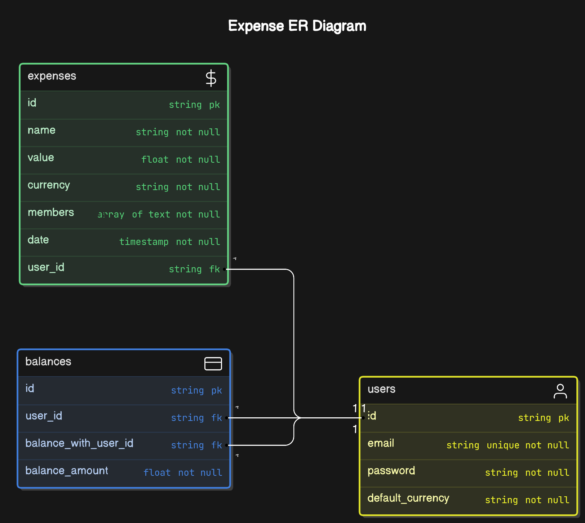

## Splitwise API

## How to run

```sh
cp .env.example .env
```

```sh
pnpm install
```

# Test the endpoints

```sh
pnpm jest
```

# Run the server

```sh
pnpm dev
```

## Postman

- use postman to test the endpoints
- import the postman collection from the postman folder

## ER-DIAGRAM

